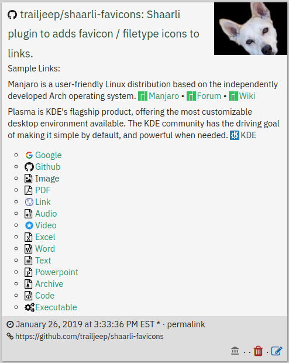

# shaarli-favicons
[Shaarli](https://github.com/shaarli/Shaarli) plugin to add favicon/filetype icons to links.

Tested with Shaarli [default](https://github.com/shaarli/Shaarli/tree/master/tpl/default) and [Shaarli-Material](https://github.com/kalvn/Shaarli-Material) templates.

## Considerations
- May slow down page load time, especially if Links per page is set high.
- Webserver [HTTP Content-Security-Policy img-src](https://developer.mozilla.org/en-US/docs/Web/HTTP/Headers/Content-Security-Policy/img-src) directive (specifies valid sources of images and favicons) if set should exempt (`<host-source>`):
    - `https://www.google.com`
    - `https://api.iconify.design`

## Screenshot



## Installation
The plugin's folder (`favicons`) should be placed in the `<shaarli>/plugins/` directory.

The directory structure should look like:

```bash 
└── plugins
    └── favicons
        ├── favicons.css
        ├── favicons.js
        ├── favicons.meta
        ├── favicons.php
        └── jquery-3.3.1.slim.min.js
```

To enable the plugin, just check it in the Plugin Administration page (`?do=pluginadmin`).

You can also add `favicons` to your list of enabled plugins in `data/config.json.php`.\
The `general.enabled_plugins` list should look like this:

```
"general": {
  "enabled_plugins": [
    "favicons",
    [...]
  ],
}
```

## Configuration
None - enable/disable in the Plugin Administration page.

## Credits
- [Google Favicon snatcher](https://www.google.com/s2/favicons?domain=www.google.com)
- [Iconify.design](https://iconify.design/)
- [Add Auto-sensing File Type Icons to lists of downloads, with FontAwesome and CSS](https://gschoppe.com/uncategorized/add-auto-sensing-file-type-icons-to-lists-of-downloads-with-fontawesome-and-css/) by [Greg Schoppe](http://gschoppe.com)
-  [ jQuery 3.3.1](https://code.jquery.com/jquery-3.3.1.slim.min.js)
